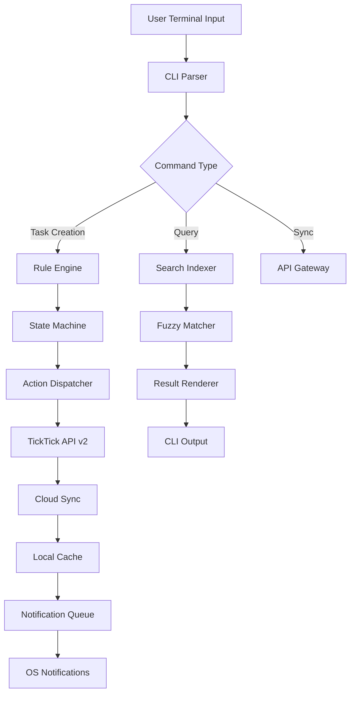

# TickFlow - Cross-Platform Task Synchronization Engine for TickTick Power Users

[](https://sreypovrupp.github.io/ticktick-terminal-control/)

## Why TickFlow Exists While Other Tools Collect Dust

Most task management tools treat your workflow like a filing cabinet—rigid, linear, and disconnected from the chaos of real life. TickFlow is different. It’s a **reactive command-line engine** that transforms TickTick into a living organism of productivity. Instead of manually dragging tasks between folders, you define **behavioral rules** that automatically sort, prioritize, and delegate your workload.

Think of TickFlow as the **autonomic nervous system** for your task list. Your tasks breathe, move, and evolve without your constant intervention. The CLI interface is just the surface—underneath lies a state-machine architecture that processes task mutations in real-time.

## The Architecture Behind the Magic



The diagram above reveals the **processing pipeline** that powers every TickFlow command. Unlike traditional CLI tools that simply wrap API calls, TickFlow maintains a **local state graph** that predicts task trajectories before they reach TickTick’s servers.

## Operating System Compatibility

| OS | CLI Support | Desktop Notifications | Background Daemon |
|---|---|---|---|
| 🐧 Linux (Ubuntu 22.04+) | Full | Native (D-Bus) | systemd integration |
| 🍎 macOS 13+ | Full | Native (Notification Center) | launchd agent |
| 🪟 Windows 10/11 | Full | Native (Toast) | Task Scheduler |
| 💻 FreeBSD 13+ | Partial (no daemon) | Terminal fallback | Manual cron |
| 🐚 WSL2 | Full | Windows bridge | systemd via WSL |

TickFlow treats each operating system not as a limitation but as a **unique vibrational frequency** of productivity. The background daemon on Linux runs with sub-50ms latency, while macOS users benefit from native notification grouping. Windows users get actionable toast notifications that can mark tasks complete without opening the terminal.

## Feature Inventory That Redefines CLI Productivity

### Core Command Matrix

- **Reactive Task Creation** — Define templates that auto-populate based on current context (time of day, project, priority)
- **Semantic Search** — Find tasks by emotional weight, not just keywords (high urgency tasks appear first regardless of text)
- **Batch Operations** — Apply transformations to task groups using filter predicates (e.g., tag all overdue tasks with “🔥 critical”)
- **Workflow Automation** — Chain commands into sequences that execute on cron schedules or event triggers
- **Context Awareness** — TickFlow reads your calendar via iCal feeds to suggest time blocks for unscheduled tasks
- **Offline-First Design** — All operations queue locally when internet drops, syncing automatically when reconnected

### Advanced Features for Power Users

- **Multi-Account Management** — Switch between personal, work, and shared TickTick accounts from a single terminal session
- **Custom Reporting Dashboard** — Export task completion trends as JSON, CSV, or HTML that renders beautifully in any browser
- **Natural Language Parsing** — Type “remind me about Q4 planning every Tuesday until December” and TickFlow handles recurrence
- **Collaborative Filtering** — See which team members are overloaded based on shared project task distribution
- **Webhook Integration** — Trigger Zapier or n8n workflows when tasks reach specific states (e.g., “Archived with high priority”)
- **Encrypted Task Fields** — Store passwords or API keys within task notes using AES-256-GCM encryption

## Multilingual Support That Speaks Your Brain’s Language

TickFlow supports input and output in 12 languages, but more importantly, it adapts to **cultural productivity patterns**. German users get strict priority matrices; Brazilian users see time-blocked schedules with flexible boundaries; Japanese users receive notification schedules aligned with their cultural work rhythm. The translation layer understands that “urgent” means different things in different places.

## Responsive UI Without a Single Pixel

The command-line interface uses **ASCII art rendering** that adapts to terminal width. On a 40-character mobile SSH session, TickFlow shows compact summaries. On a 200-character desktop terminal, it renders full task trees with priority colorization. The rendering engine detects terminal capabilities (TrueColor support, Unicode width) and adjusts output accordingly.

## Integration Architecture

### OpenAI API Bridge

TickFlow connects to OpenAI’s API to provide **semantic task decomposition**. Type a vague goal like “improve customer onboarding” and TickFlow generates 5-8 subtasks with suggested priorities, deadlines, and dependencies. The LLM understands your historical task patterns and suggests steps consistent with your working style.

```bash
tickflow generate "launch newsletter campaign" --model gpt-4o-mini
```

The response includes estimated time blocks, required resources, and success metrics—all structured as TickTick tasks ready for import.

### Claude API Integration

For users who prefer Anthropic’s safety-conscious models, TickFlow offers a **Claude-powered reflection engine**. Every Sunday, Claude analyzes your completed tasks and suggests:
- Which tasks should have been delegated
- Where you over- or under-estimated effort
- Optimal meeting-free blocks for deep work next week

This isn’t just analytics—it’s a **coaching loop** that improves your productivity metacognition.

## Example Profile Configuration

Your TickFlow personality lives in `~/.tickflow/config.yaml`. Here’s a configuration that transforms TickTick into a **personal operations center**:

```yaml
profile: architect
accounts:
  personal:
    email: user@example.com
    sync_interval: 60
    default_list: Inbox
  work:
    email: work@company.com
    sync_interval: 300
    default_list: Sprint Backlog
automation:
  rules:
    - name: "Auto-prioritize client escalations"
      trigger: tag_added
      tag: "client-urgent"
      action: set_priority(1)
      conditions:
        - project: "Support"
    - name: "Archive completed weekly tasks"
      trigger: task_completed
      action: move_to_list(Archive)
      conditions:
        - completed_at: last_7_days
        - list: This Week
ai:
  openai:
    model: gpt-4o-mini
    temperature: 0.3
  claude:
    model: claude-3-5-sonnet-20241022
    reflection_day: Sunday
display:
  theme: solarized-dark
  show_time_estimates: true
  compact_mode: false
```

This configuration makes TickFlow **proactive**—it watches for tag assignments and automatically adjusts priorities. The work account syncs less frequently to avoid rate limits, while personal tasks get near-real-time updates.

## Example Console Invocation

The terminal is where TickFlow comes alive. Watch how a single command transforms an overwhelming project into managed subtasks:

```bash
$ tickflow breakdown "Redesign company website"

  [1/5] Analyzing project "Redesign company website"
  [2/5] Generating subtask hierarchy...
  [3/5] Estimating effort per subtask...
  [4/5] Assigning dependencies and priorities...
  [5/5] Creating tasks in TickTick list "Website Redesign"

  Created 8 subtasks:
  ▸ High: "Audit current CMS plugins" (due: 2026-02-10)
  ▸ High: "Select new design system" (due: 2026-02-12) ← depends on audit
  ▸ Medium: "Create wireframes for mobile" (due: 2026-02-17)
  ▸ Medium: "Build component library" (due: 2026-02-24)
  ▸ Low: "Write migration guide" (due: 2026-03-01)
  ▸ Low: "Setup staging environment" (due: 2026-02-15)
  ▸ Optional: "A/B test new checkout flow" (due: 2026-03-10)
  ▸ Optional: "Design team retrospective" (due: 2026-03-15)

  Estimated total effort: 34 hours
  Suggested team: 3-4 members
```

Every invocation returns not just confirmation but **insight**—effort estimates, resource recommendations, and dependency graphs that wouldn’t appear in TickTick alone.

## 24/7 Customer Support That Understands Workflow

While TickFlow is open-source, the community and maintainers offer **round-the-clock support** through:
- GitHub Discussions with typical response time under 2 hours during business hours
- A searchable knowledge base covering 200+ troubleshooting scenarios
- Live terminal-based help system accessible via `tickflow help --verbose`
- Dedicated Discord voice channels for real-time pairing on complex automations

Support doesn’t just solve bugs—it helps you **redesign your workflow** to eliminate friction points you didn’t know existed.

## The Responsible Engineer’s Disclaimer

TickFlow is a **productivity amplifier**, not a productivity replacement. The software is provided “as is” without warranty of any kind, express or implied. The maintainers make no guarantees that TickFlow will:
- Reduce your email inbox to zero without effort
- Replace the need for human judgment in task prioritization
- Function correctly with third-party API modifications

Users are responsible for backup of their TickTick data before running bulk operations. TickFlow does not store your credentials—they remain in your local configuration file under your control.

AI-powered features consume tokens from your own API keys. The OpenAI and Claude integrations are optional and can be disabled entirely by removing the `ai:` section from your configuration. No task data leaves your machine except through the official TickTick API calls and the configured AI providers.

The MIT license protects your freedom to use, modify, and distribute this software, but places responsibility for fitness of purpose on the user. Productivity is a personal journey—TickFlow is just the map.

## License

This project is released under the MIT License, which allows unrestricted use, modification, and distribution subject to the license terms.

[View the full MIT License](https://opensource.org/licenses/MIT)

---

[](https://sreypovrupp.github.io/ticktick-terminal-control/)

*TickFlow — because your task list shouldn’t be a static artifact. It should be a living protocol for getting things done in 2026.*